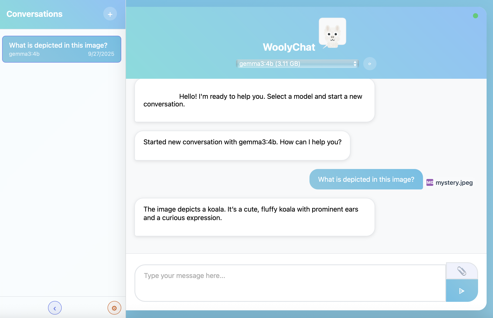
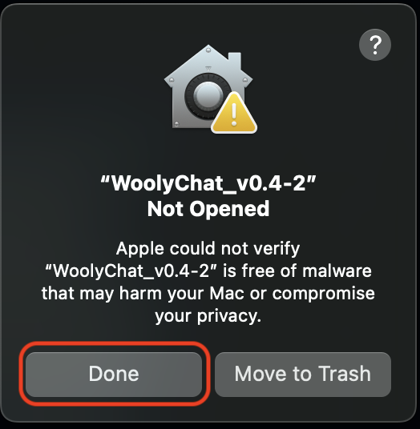
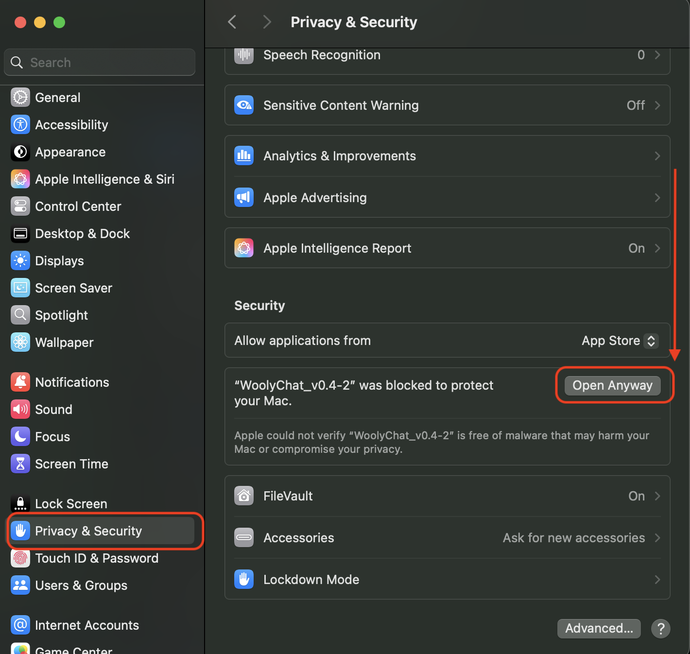

# 🐑 WoolyChat - Standalone Ollama AI Chat Interface

**A beautiful, easy-to-use desktop application for chatting with AI models through Ollama**

WoolyChat provides a contemporary web interface for Ollama with file attachments, conversation management, and a guided setup wizard - all packaged as a standalone desktop app that requires no technical setup.

I am planning to add things like Projects, Project Knowledge, folders, and unstructured tagging, but who knows when that'll happen. I only went down this rabbit hole because Open WebUI stopped letting me login locally and I didn't get why I needed an account with them in the first place.

Enjoy these early, possibly buggy releases below. I vibe-coded the heck out of this.

## ✨ Features

- **🎯 Zero-Configuration Setup** - Guided setup wizard handles everything
- **🤖 Multiple AI Models** - Works with any Ollama-compatible model
- **📎 File Attachments** - Upload images, documents, PDFs, and more
- **💬 Conversation Management** - Save, organize, and search your chats
- **🎨 Beautiful Themes** - 12+ built-in themes to customize your experience
- **📱 Responsive Design** - Works great on desktop and mobile browsers
- **🔒 Privacy-First** - All data stays on your computer

## 📥 Download

### macOS (Apple Silicon & Intel)
**[Download WoolyChat v0.4 for macOS](https://github.com/haasr/woolychat_releases/raw/refs/heads/main/releases/WoolyChat_v0.4.zip)** (Latest Release)

**System Requirements:**
- macOS 10.14 (Mojave) or later
- 4GB+ free disk space (for AI models)
- Internet connection (for downloading models)

### Windows
**Coming Soon!** Windows version will be available soon.

**System Requirements:**
- Windows 10/11 (64-bit)
- 4GB+ free disk space (for AI models)
- Internet connection (for downloading models)

## 🚀 Quick Start Guide

### macOS Installation

1. **Download & Extract**
   - Download the [WoolyChat_v0.4 app](https://github.com/haasr/woolychat_releases/raw/refs/heads/main/releases/WoolyChat_v0.4.zip) file
   - Drag `WoolyChat` to your Applications folder (optional)

2. **First Launch: Allow App**
- Double-click `WoolyChat` to launch. You are imediately going to be met with an alarming pop-up window.
- The pop-up window (shown below) is because Apple doesn't know me, so they're trying to keep you safe!
- I'm just trying to use your Mac to mine crypto (jk; you can view the app's [source code](https://github.com/haasr/woolychat) in the main repository).

- To allow my app, first make sure you clicked "Done" (to close the pop-up).
- Next, scroll to the bottom of your Privacy & Security settings and select "Open Anyway".

- Now you'll be able to open it and proceed to step 2.

3. **First Launch: Simple Setup**
   - Follow the setup wizard if you have not already used Ollama
   - Once done with the setup steps, click "Continue to WoolyChat".
   - Click "Start WoolyChat Server", then "Open in Browser".
   - When not in use, you can stop the server or keep it running.
   - **Important:** If prompted about network access, click **"Allow"** to let WoolyChat start its web server
   - Follow the setup wizard to install Ollama and download AI models

4. **Start Chatting**
   - Choose an AI model from the dropdown
   - Type your message and press Enter
   - Attach files by clicking the paperclip icon or dragging files into the chat

### Setup Wizard Steps

WoolyChat includes a friendly setup wizard that will:

1. **Check for Ollama** - Automatically detects if Ollama is installed
2. **Guide Installation** - Opens the Ollama download page if needed
3. **Model Selection** - Helps you choose and download your first AI model:
   - **Gemma3:4b** (3.3 GB) - Best all-around model ⭐ *Recommended*
   - **Llama3.2:3b** (2.0 GB) - Lightweight for basic tasks
   - **DeepSeek-R1:7b** (4.7 GB) - Advanced reasoning with chain-of-thought
4. **Ready to Chat** - Automatically opens WoolyChat in your browser

### More on Models

The model selection just lists 3 options that I thought strike a nice balance between size (in billions of parameters) and utility for end-user desktops and laptops.

### Installing your own

You can use any ollama models with WoolyChat, by installing them through the ollama command-line interface. If you don't know what I'm talking about, open Windows Terminal or Terminal (MacOS) and type `ollama --version`. If Ollama is installed, you'll get a print out of its version.

Don't be intimidated by the prospect of using a terminal. The ollama commands are super simple and can be learned in 5 minutes! [See this blog post](https://medium.com/@gabrielrodewald/running-models-with-ollama-step-by-step-60b6f6125807)

Find a model you'd like to try [on the Ollama website](https://ollama.com/search) and use `ollama pull <name of the model here>` in your terminal. Once the model's installation is complete, simply refreshing your WoolyChat browser tab will allow you to start chatting with it.

**Pro tip**: If you aren't running super duper hardware, I would stick to models that have "8b" or less in the name (e.g., `deepseek-r1:7b`). That "b" stands for billion, as in, "this model has 7 billion parameters" ([learn more about parameters here](https://www.ibm.com/think/topics/model-parameters)). On my MacBook Air M4, the biggest model I use is `gemma3:12b` (for handwriting OCR) and for how slow it is on my Mac, the performance difference (improved accuracy/completeness) is very modest if even noticeable. My MacBook can run 4b models without much latency -- the Chat GPT experience -- and I like using the Granite3.3 8b model for summarizing or extracting topics from documents. After 8b params, things slooow down. But on more traditional laptop hardware (i.e., no Apple Silicon), you may find that you need to tend to 1-3b-parameter models.

#### Gemma 3:4b as top choice

I'm most impressed with Gemma3 all around! At the 4-billion-parameter size, it's versatile enough to summarize documents or generate ideas and I personally like that it also can OCR images, making it a stand-out among the free models of this size (because it isn't fine-tuned to only excel at that, yet performs better than some of the vision models like Granite and Llava), and all with super-low latency on my MacBook Air M4. I could not tell a difference in performance among the 4- and 8-billion parameter Gemma3 models. Even the Gemma3 12-billion parameter model only performed slightly better than the others at extracting handwriting from images relative to the 27b model (which did the best by far).

#### Llama 3.2:3b: capable for small size

I have not been impressed by earlier editions of Meta's Llama models (ironic since they gave us the Ollama platform, perhaps the only "good" thing I will ever credit Meta with!), but the 3.2 models actually seem pretty capable even at small size. I think Gemma3 still outshines Llama 3.2, so if your computer can handle an extra billion parameters, I'd still stick with Gemma3 (especially since it can analyze images).

#### Granite 3.3:8b: good at summarizing/extracting document info

I haven't used this model much, but I was really delighted by how well it has been summarizing documents and extracting information relevant to my questions.

## 🔧 Important Notes

### macOS Security & Permissions

**Network Access Permission:**
When you first start WoolyChat, macOS may show a dialog asking if you want to allow the application to accept incoming network connections. **You must click "Allow"** for WoolyChat to work properly. This permission allows the app to run a local web server that your browser connects to.

### Data Storage

WoolyChat stores all your data in a safe, standard location:
- **macOS:** `~/Library/Application Support/WoolyChat/`
- **Windows:** `%APPDATA%/WoolyChat/`

This includes:
- Your conversation history and database
- Uploaded file attachments
- App settings and preferences

## 🛠️ Troubleshooting

### Common Issues

**"Cannot connect to server" error:**
- Make sure you clicked "Allow" when prompted for network access
- Try quitting and restarting WoolyChat
- Check the launcher window to mak sure the server is running

**Ollama not found:**
- The setup wizard will guide you to install Ollama
- Make sure Ollama is properly installed from [ollama.com](https://ollama.com)

**Models not downloading:**
- Ensure you have a stable internet connection
- Large models (5GB+) can take 10+ minutes to download
- Check available disk space (models require 2-8GB each)

**App won't start:**
- Try moving the app to your Applications folder
- Make sure you're running macOS 10.14 or later
- Check Console.app for error messages

## 🎯 What's New in v0.4

- ✅ **Standalone Desktop App** - No more terminal commands or Python setup
- ✅ **Guided Setup Wizard** - Automatic Ollama installation and model management
- ✅ **Improved File Handling** - Better support for PDFs, Word docs, and images

## 🔮 Coming Soon

- Nothing. Don't get your hopes up.
- Will have a Windows exe in a couple days tho fr.

## 📋 Technical Details

**Built with:**
- Python 3.12.10 with Flask web framework
- Tkinter for the launcher GUI
- SQLite for data storage
- Ollama for AI model inference
- PyInstaller for desktop packaging

**Privacy & Security:**
- All processing happens locally on your computer
- No data is sent to external servers

---

**WoolyChat** - It's not Open WebUI, but it's not Open WebUI 🐑✨

The source code and setup instructions are available in the [main repository](https://github.com/haasr/woolychat).